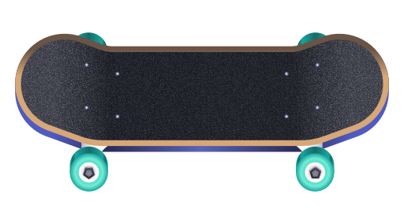

  

<h1 align="center">
  Throwdown
</h1>

  

<h5 align="center">
  Throwdown is a fun little libadwaita/GTK4 app written in Python for  generating random skate trick combos with adjustable difficulty!
</h5>

---

### introduction:

Originally created as a standalone CLI app (drafted in bash / completed in Python) for getting better at skateboarding (in real life, as well as in video games like Session: Skate Sim and Skater XL). I always wanted to develop a libadwaita app, so this became the perfect challenge for me to turn it into my first GTK app as a non-programmer!

### features:

- Three levels of difficulty (easy, medium, hard) and random mode
- Type of modules: stance, direction, spin, flip, grind, lateflip & ground tricks
- Named tricks (example: `Fakie BS 360` -> `Full Cab`)
